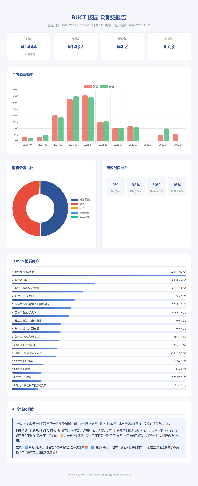
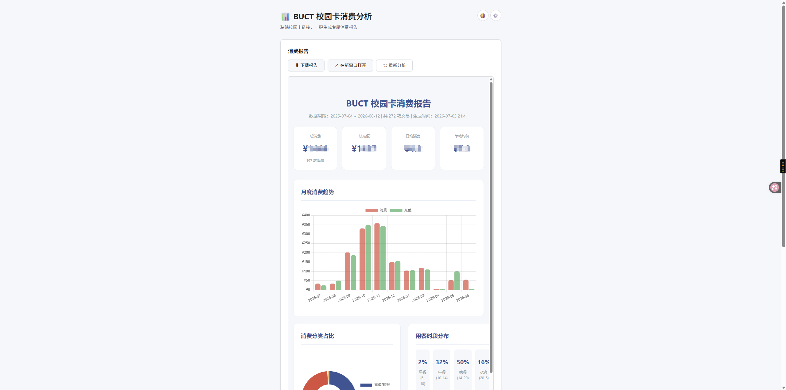
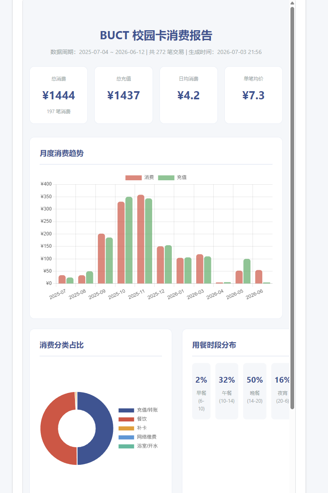
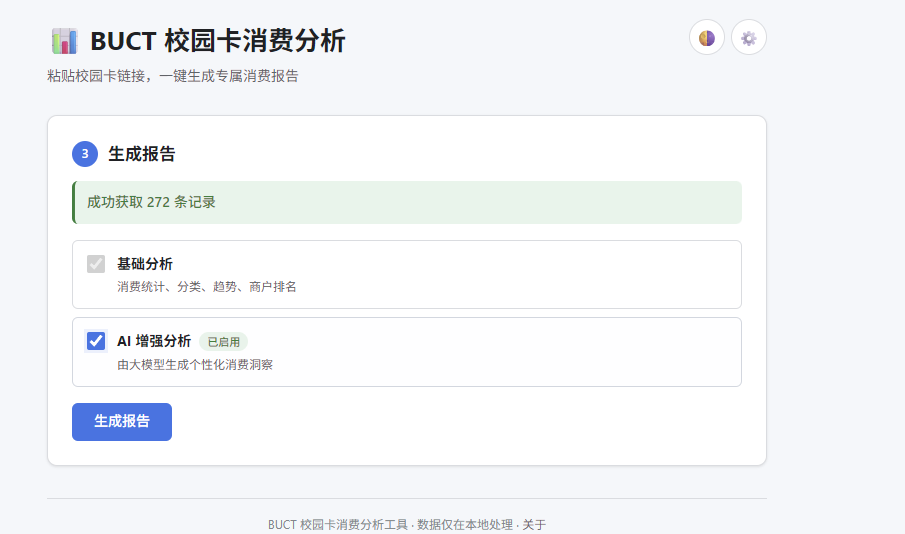
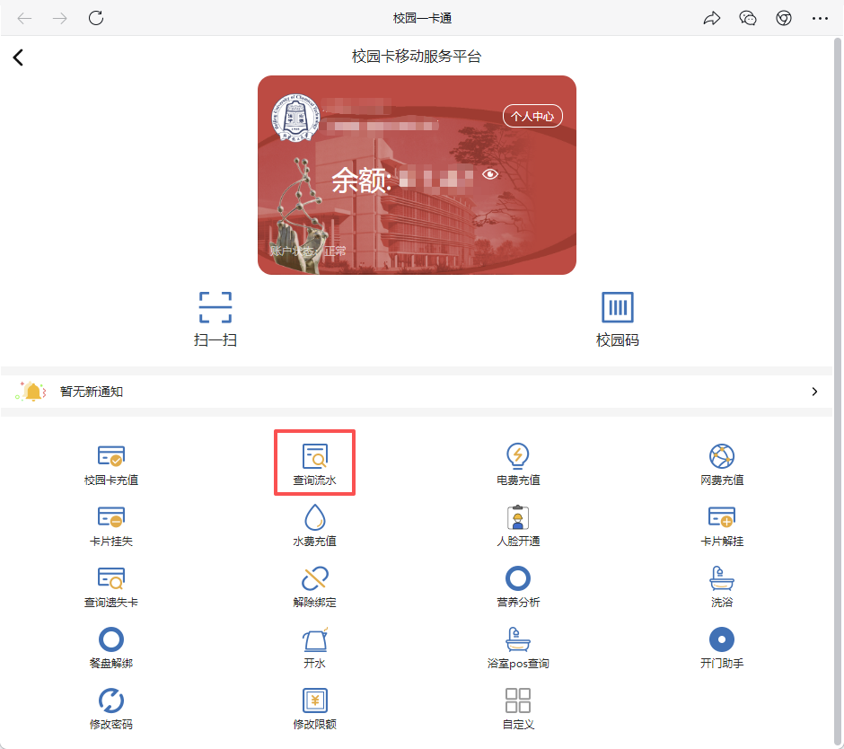
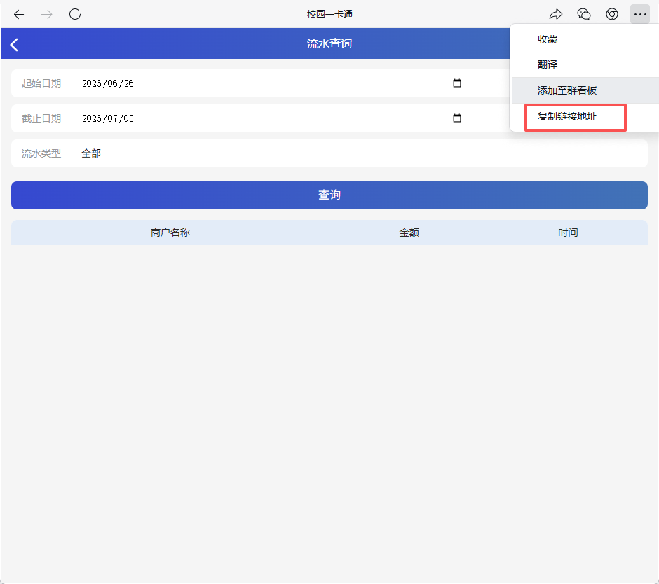

# 📊 BUCT 校园卡消费分析

> 北京化工大学校园卡消费数据分析与可视化报告生成器

一个开箱即用的本地工具：粘贴校园卡链接，自动拉取近 **10 个月**的消费流水，生成精美的可视化报告，并可选用大模型生成个性化消费洞察。所有数据仅在本地处理，**不会上传到任何服务器**。

---

## 📸 效果预览

| | |
|---|---|
|  |  |
| **完整报告长截图**（一键导出） | **主界面**（报告嵌入预览） |
|  |  |
| **图表细节**（KPI + 趋势 + 占比） | **AI 增强选项**（服务商预设 + 测试连接） |
|  |  |
| **企业微信一卡通**（查询流水入口） | **复制链接地址**（操作菜单） |

---

## ✨ 功能特性

### 数据获取
- 🤖 通过无头浏览器（Playwright）自动模拟登录并抓取校园卡流水
- 📅 支持自定义时间范围（默认近 10 个月，按 31 天分批拉取）
- 💾 **本地缓存**——相同时间范围的二次分析秒级返回，无需重复启动浏览器
- 🔄 支持「跳过缓存，强制重新拉取」

### 数据分析
- 📈 月度消费 / 充值趋势对比
- 🍔 消费分类占比（餐饮、饮品、充值、网络缴费等 10 大类）
- 🏪 TOP 15 消费商户排名
- 🍽️ 用餐时段分布（早餐 / 午餐 / 晚餐 / 夜宵）
- 📊 总消费、总充值、日均消费、单笔均价等 KPI

### AI 增强（可选）
- 🧠 接入任意 OpenAI 兼容大模型生成个性化消费洞察
- ⚙️ **页面内可视化管理** LLM 配置（无需环境变量）
- 🔌 一键测试连接，支持 DeepSeek / 通义千问 / 硅基流动 / 智谱 / OpenAI 等预设
- 🔒 API Key 仅保存在本地配置文件中，前端始终掩码显示
- ✨ AI 输出支持 Markdown 渲染（marked + DOMPurify）

### 使用体验
- 🎨 现代化 UI，支持**深色模式**（跟随系统偏好）
- ⚡ 基于 SSE 的实时进度推送（替代轮询，延迟 < 200ms）
- 🍞 Toast 通知、模态框、快捷日期选择
- 📱 完整响应式布局，移动端友好
- 📷 **一键导出长截图**（2× 高清 PNG，完整滚动页面）—— 由后端 Playwright 真实渲染
- 📤 **交易明细导出**（CSV / XLSX，含自动分类）—— CSV 带 UTF-8 BOM 兼容中文 Excel，XLSX 走 openpyxl 带表头样式
- 📥 **导入 CSV**（复用本工具导出的明细文件，或任意含「交易时间/商户/金额」三列的 CSV）—— 跳过抓取，直接进入分析
- 🏫 **入学日期一键拉取** —— 输入入学日期，自动从入学日拉到今天
- ♿ 支持 `prefers-reduced-motion` 无障碍偏好

---

## 🚀 快速开始

### 环境要求

- **Python** 3.10+
- **Chromium**（由 Playwright 自动下载，无需手动安装）

### 安装

```bash
# 1. 克隆仓库
git clone https://github.com/your-name/BUCT_Card_Report.git
cd BUCT_Card_Report

# 2. 安装 Python 依赖
pip install -r requirements.txt

# 3. 安装 Playwright 浏览器内核（仅首次）
playwright install chromium
```

### 运行

```bash
python app.py
# 打开 http://localhost:5000
```

---

## 📖 使用指南

### 第一步：获取校园卡链接

1. 在**企业微信**中找到「校园一卡通」入口，进入「个人中心」

2. 在主页找到「**查询流水**」入口

   

3. 进入「流水查询」页面后，点击右上角 `⋯` → 「**复制链接地址**」

   

4. 粘贴的链接形如：

   ```
   https://mcard.buct.edu.cn/selftrade/openQueryCardSelfTrade?openid=xxx&displayflag=1&id=23
   ```

> ⚠️ 链接中的 `openid` 是长期有效的身份标识；若链接里只有 `code=` 而没有 `openid=`，说明复制的是一次性 OAuth 跳转链接，需重新从企业微信打开。

### 第二步：生成报告

1. 将链接粘贴到本应用输入框
2. 选择时间范围（可点击「近1月 / 近3月 / 近半年 / 近10月」快捷选择）
3. 点击「开始分析」，等待数据拉取（首次约 10–30 秒，命中缓存则秒级返回）
4. 在「生成报告」步骤勾选是否启用 AI 增强
5. 点击「生成报告」，报告将内嵌展示，可下载、导出长截图或在新窗口打开


### 第三步：配置 AI 增强（可选）

点击页面右上角的 ⚙️ 设置按钮：

1. **选择服务商预设**（或选「自定义」填写兼容 OpenAI 协议的任意端点）
2. 填写 **Base URL** 和 **模型名称**（预设会自动填入）
3. 输入 **API Key**（保存后仅以 `sk-1****cdef` 形式显示）
4. 点击「🔌 测试连接」验证配置是否生效
5. 勾选「启用 AI 增强分析」并保存


配置文件存储位置：

| 平台 | 路径 |
|------|------|
| Windows | `%APPDATA%\BUCT_Card_Report\config.json` |
| macOS / Linux | `~/.config/BUCT_Card_Report/config.json` |

> 💡 该文件权限已限制为仅所有者可读写（POSIX 系统 `0600`）。环境变量 `LLM_API_KEY` / `LLM_BASE_URL` / `LLM_MODEL` 仍可作为覆盖项，便于容器化部署。

---

## 🏗️ 项目结构

```
BUCT_Card_Report/
├── app.py                      # Flask 主应用，路由与状态管理
├── config.py                   # 配置管理（本地持久化 + 环境变量覆盖）
├── requirements.txt
├── pytest.ini
│
├── fetcher/                    # 数据抓取层
│   ├── browser.py              #   Playwright 无头浏览器抓取
│   ├── url_parser.py           #   校园卡链接解析与校验
│   ├── cache.py                #   本地交易缓存（TTL 30 分钟）
│   └── models.py               #   Transaction 数据模型
│
├── analyzer/                   # 数据分析层
│   ├── stats.py                #   多维度统计计算
│   └── categories.py           #   商户分类规则
│
├── reporter/                   # 报告渲染层
│   ├── renderer.py             #   Jinja2 渲染入口
│   └── templates/report.html   #   自包含 HTML 报告模板（Chart.js / marked / DOMPurify）
│
├── llm/                        # 大模型层
│   └── insights.py             #   OpenAI 兼容客户端 + 连接测试
│
├── templates/index.html        # 主页 UI
├── static/
│   ├── css/style.css           #   样式（含深色模式变量）
│   └── js/main.js              #   前端逻辑（SSE / Toast / 设置面板）
│
├── assets/                     # README 截图资源
│
└── tests/                      # 测试套件（66 个用例）
    ├── test_url_parser.py
    ├── test_stats.py
    ├── test_categories.py
    ├── test_renderer.py
    ├── test_config.py
    ├── test_llm_insights.py
    ├── test_cache.py
    └── test_screenshot.py
```

---

## 🔌 API 文档

| 方法 | 路径 | 说明 |
|------|------|------|
| `GET` | `/` | 主页 |
| `POST` | `/api/fetch` | 启动数据抓取（后台线程）<br>Body: `{url, start_date, end_date, force_refresh}` |
| `GET` | `/api/status` | 查询抓取进度（轮询备用） |
| `GET` | `/api/status/stream` | **SSE** 实时进度流 |
| `POST` | `/api/report` | 生成报告 HTML<br>Body: `{use_llm: bool}` |
| `GET` | `/api/report/download` | 下载报告文件 |
| `GET` | `/api/report/screenshot` | **导出长截图**（PNG，2× DPR 完整滚动页） |
| `GET` | `/api/transactions/export?format=csv\|xlsx` | **导出交易明细**（CSV 带 UTF-8 BOM / XLSX 带表头样式） |
| `POST` | `/api/transactions/import` | **导入 CSV**（multipart file upload） |
| `GET` | `/api/llm/config` | 读取 LLM 配置（Key 掩码） |
| `POST` | `/api/llm/config` | 更新并持久化 LLM 配置 |
| `POST` | `/api/llm/test` | 测试 LLM 连接 |
| `GET` | `/api/cache` | 查询缓存统计 |
| `DELETE` | `/api/cache` | 清空缓存 |

### `/api/fetch` 示例

```bash
curl -X POST http://localhost:5000/api/fetch \
  -H "Content-Type: application/json" \
  -d '{
    "url": "https://mcard.buct.edu.cn/selftrade/openQueryCardSelfTrade?openid=xxx",
    "start_date": "2025-09-01",
    "end_date": "2026-07-03",
    "force_refresh": false
  }'
```

---

## 🧪 开发与测试

```bash
# 运行全部测试
python -m pytest

# 运行单个模块
python -m pytest tests/test_config.py -v

# 查看覆盖率（需安装 pytest-cov）
python -m pytest --cov=. --cov-report=term-missing
```

测试覆盖了 URL 解析、统计计算、分类规则、报告渲染、配置持久化、LLM 调用（mock）、缓存读写、截图端点等核心逻辑，共 **66 个用例**。

---

## ❓ 常见问题

**Q: 提示「链接中未找到 openid 参数」？**
A: 请确认复制的是企业微信内校园卡页面的完整 URL，且地址栏中包含 `openid=`。若只有 `code=`，需重新从企业微信打开页面。

**Q: 数据抓取很慢？**
A: 首次抓取需启动无头浏览器并分批请求（每 31 天一批），10 个月数据约需 10–30 秒。相同时间范围的二次分析会命中本地缓存，秒级返回。如需强制刷新，勾选「跳过缓存」。

**Q: AI 增强分析报错？**
A: 在设置面板点击「测试连接」查看具体错误。常见原因：API Key 无效、Base URL 拼写错误、模型名称不存在、账户余额不足。

**Q: 配置文件存在哪里？如何重置？**
A: 见上方「配置文件存储位置」表格。删除该文件即可恢复默认配置。也可在「关于」面板一键清空缓存。

**Q: 支持其他学校的校园卡吗？**
A: 当前仅适配北京化工大学（`mcard.buct.edu.cn`）。如需支持其他学校，需修改 `fetcher/url_parser.py` 的域名白名单和 `fetcher/browser.py` 的抓取逻辑。

**Q: 数据安全吗？**
A: 完全本地处理。交易数据仅在你的浏览器与本地 Flask 进程间流转，LLM 调用仅在启用 AI 增强时将**统计摘要**（非原始流水）发送给你配置的模型服务商。

---

## 🛠️ 技术栈

| 层 | 技术 |
|----|------|
| 后端 | Python 3.10+ · Flask |
| 抓取 | Playwright（Chromium 无头浏览器） |
| 分析 | 纯 Python 标准库 |
| 渲染 | Jinja2 · Chart.js · marked · DOMPurify |
| LLM | OpenAI Python SDK（兼容协议） |
| 前端 | 原生 JS · CSS 变量 · Server-Sent Events |
| 测试 | pytest |

---

## 📝 许可证

本项目仅供学习交流使用。请勿用于商业用途，使用时请遵守学校相关规定。

## 🤝 贡献

欢迎提交 Issue 和 Pull Request。提交前请确保：

```bash
python -m pytest          # 测试全绿
```
